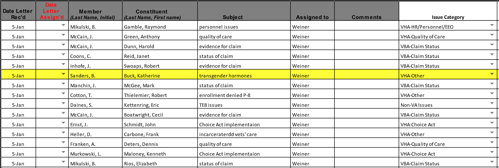
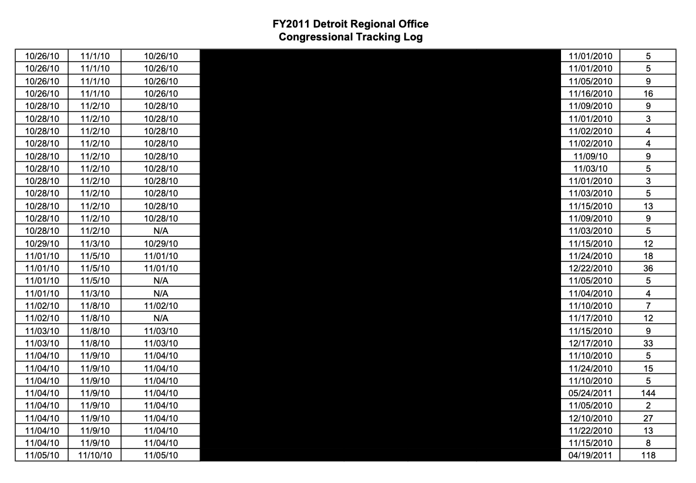
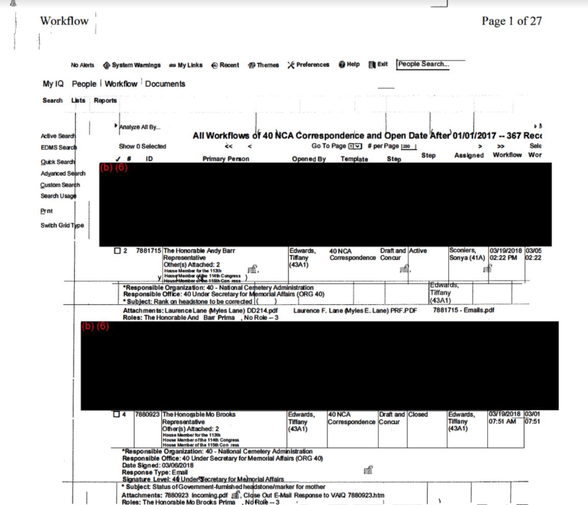
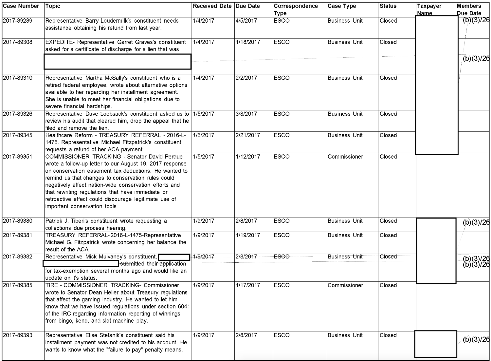
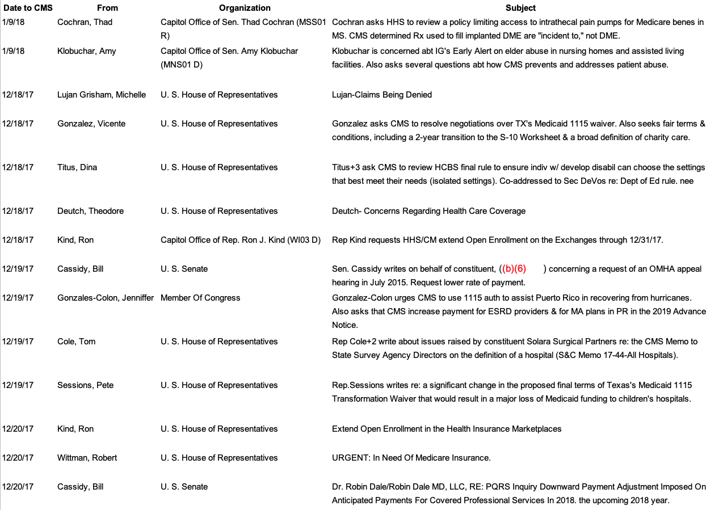
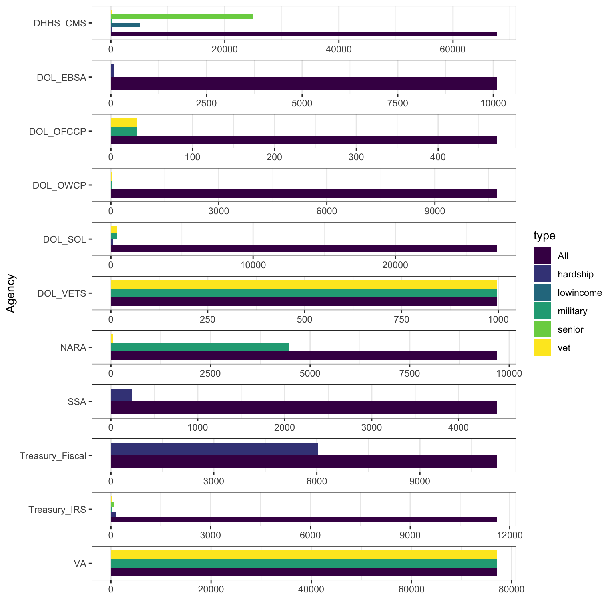

```{r setup, include = FALSE, cache = TRUE, echo = FALSE}
# chunks options:
# hide code and messages by default (warning, message)
# cache everything 
knitr::opts_chunk$set(eval = TRUE, 
                      echo = FALSE,
                      warning = FALSE, 
                      message = FALSE,
                      cache = FALSE,
                      fig.retina = 2,
                      fig.align = "center", 
                      dpi = 100)
# Xaringan: https://slides.yihui.name/xaringan/
library("xaringan")
library("xaringanthemer")
library("here")


mono_light(base_color = "#3b444b",
          link_color = "#B7E4CF",
          #background_color = "#FAF0E6", # linen
          header_font_google = google_font("PT Sans"), 
          text_font_google = google_font("Old Standard"), 
          text_font_size = "28px",
          padding = "10px",
          code_font_google = google_font("Inconsolata"), 
          code_inline_background_color    = "#F5F5F5", 
          table_row_even_background_color = "#d5e3dd",
          extra_css = 
            list(".remark-slide-number" = list("display" = "none")))

```

```{r, eval = FALSE, include= FALSE}
# setup
devtools::install_github("yihui/xaringan")
devtools::install_github("gadenbuie/xaringanthemer")
install.packages("webshot")
# webshot::install_phantomjs()

library(webshot)

# export to pdf
file <- here("present/whyMail-APW.html")
webshot(file, "whyMail-APW.pdf")
```


# Outline

1. What is constituent service?

1. Theory: Reasons that some groups may be served more than others

1. Data: 400,000+ requests from all Members of Congress to all federal agencies

1. Which groups are better served? (difference in differences)  
- Republicans do less constituent service, 15% less for low-income constituents (within a district) 
- Veterans and seniors are served proportionate to their population; low-income residents are not
- No partisan differences in help to businesses


???
Hi, my name is Devin Judge-Lord. I'm a Ph.D. candidate at Wisconsin. 

My colleague at Wisconsin, Rochelle Snyder really led the writing and coding the data for this paper, but she, unfortunately, is teaching at this moment. 

This paper is a new piece of a much larger project we have been working on for over four years, but this specific exploration of how different types of individual constituents are served more than others is Rochelle's brainchild.

With Justin Grimmer and Ellie Powell, we are assembling a very large new database of letters and emails written by members of Congress to federal agencies.

---

# What is Constituent Service?

"help to individuals, groups, and localities in coping with the federal government." (Fenno, 1978: p. 101)

-   Individual casework

-   Organized groups

-   Unorganized groups

-   Companies

???

Representation goes beyond floor votes.

Indeed, there are far more intimate forms of representation that are less constrained by parties and by chamber procedure.

Possibly the most common act of representation is helping constituents deal with the bureaucracy. 

This has been true since legislators helped constituents get pensions after the revolutionary war and especially with the rise of the administrative state. Federal agencies now shape nearly every aspect of our lives: 

Here we focus on individual casework and a bit on help for companies. We talk more about companies and organized groups in other papers, which I would be happy to send you if you are interested. 

---

We build on important prior work that focused on legislator contacts with specific agencies. 

- Represent constituents' policy demands despite party pressure (Ritchie 2017)

- Constituents and institutional position, not ideology, drive policy oversight (Lowande 2018) 

- Descriptive $\rightarrow$ substantive representation (Lowande, Ritchie, Lauterbach, 2019)

- Bureaucrats have reasons to comply with legislator requests, and they do (Ritchie and You, 2019)

???

Molly Ritchie finds that when legislators face cross-pressures on policy issues, they directly engage the bureaucracy in order to still represent constituents even though party politics keep them from doing so legislatively.

Kenny Lowande, also focusing on policy, finds that partisan disagreement with the executive branch does not drive oversight.

Lowande, Ritchie, and Lauterbach show that legislators make more requests on behalf of constituents with whom they share marked identities.

 Ritchie and You and Mills and Kalaf-Hughes have begun to investigate whether legislator requests matter and find that they do.

Building on this work, we focus squarely on constituency service [SLIDE]


---

### Correspondence Data

Federal Energy Regulatory Commission


???

For example, here, Rep. Thornberry is writing to the Federal Energy Regulatory Commission on behalf of two companies in his district, asking for extra scrutiny on another company's permit application. 


We have several thousand such letters written to this agency, in which we use optical content recognition to extract the text. If they do not have metadata like the sender's name and date, we extract it from the text of the letter or description of the letter.

To give you a sense of the range of responses. Some agencies provided letters themselves,

---

### Correspondence Data

Department of Veterans Affairs


???

Other agencies provided logs, which range widely in the amount of information they record. 

These logs from the VA don't say much, but often enough to deduce what the letters were about.

I am going to quickly click through a few more examples, just to give you an idea of the range of these data.

### Correspondence Data

VA Detroit Regional Offices



---

### Correspondence Data

VA National Cemetary Administration



---

### Correspondence Data

Department of Homeland Security Immigration and Customs Enforcement
(ICE) 

???

at the worst, handwritten logs with obscure acronyms to indicate the topic, as in this log from ICE

---

### Correspondence Data

IRS



---

### Correspondence Data

Centers for Medicare & Medicaid Services

---

400+ FOIA requests to 294 federal agencies (a census)

400,000+ legislator requests (so far), 2007-2020

```{r, echo=FALSE, warning=FALSE, message=FALSE}
library(kableExtra)
library(tidyverse)
read_csv(here::here("data/_FOIA_response_table.csv") ) %>% 
  select(-X1) %>% 
  kable() %>% 
  kable_styling(font_size = 12) %>% 
  row_spec(17, bold = T, background = "#B7E4CF")
```

---


### Types of contacts


---




---

## Unequal Levels of Advocacy Overall

Count of letters per member per year


---


## Variation *Within* Constituent Types

Count of letters per member per year


---

## Variation *Within* Constituent Types

Count of letters per member per year


---

## Variation *Within* Constituent Types

Count of letters per member per year


---

# What explains variation in levels of constituency service across legislators?

## [?] District demographics 
## [?] Partisan-aligned differences in which groups are valorized or stigmatized


---

# District demographics

Overall, **little systematic bias** in which districts receive more service. The average letter comes from an average district (average income, percent below the poverty line, percent over 65, etc.).

### Sub-constituency size 

[ $\checkmark$ ] Strong relationships between the percent of **seniors** or **veterans** and the number of letters on behalf of these groups.

[  $\unicode{x2718}$ ]  No relationship between the percent below the poverty line or **median income** and letters on behalf of poor or working-class constituents (e.g., regarding means-tested programs)

---

## Partisan differences (in differences)


---

Republicans provide less service overall, much less to poor constituents,


but no difference in service to businesses, seniors, or military families.


---

### Questions going forward:

Can we attribute unequal representation to  
1. structural features of federalism in the U.S.?
1. members perceiving groups as "deserving"?
1. second-order constituent beliefs about whether officials will help them?

Other informative analyses?
- immigrants
- non-White constituents
- disability 

Why do Republicans do less constituent service? 

# Thank you!

???

For our questions going forward, I again want to lament the fact that Rochelle is not here because her dissertation is exactly about why constituents contact legislators and will help us get at the first question about whether we can parse the reasons for unequal representation that we find. Is it because elected officials discriminate or that constituents don't even bother reaching out to legislators who they don't believe will help them? 

Are low-income constituents paying close enough attention to who is in office that they stop seeing help when a republic takes over, or do Republican legislators put less priority on this type of representation? 


---

### Constituency Demand


