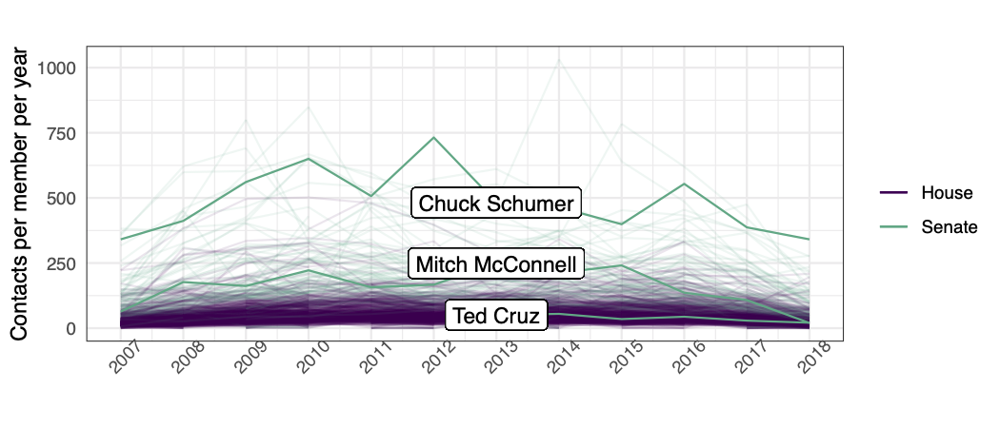
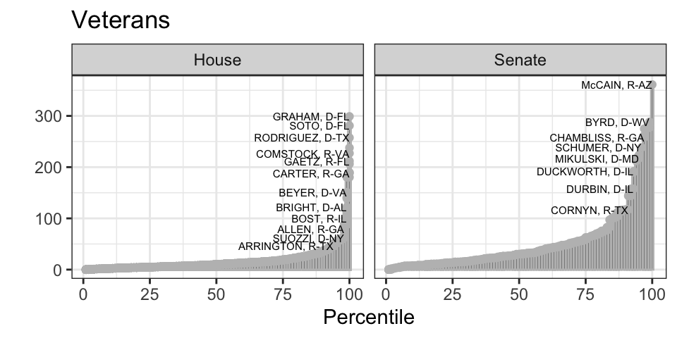
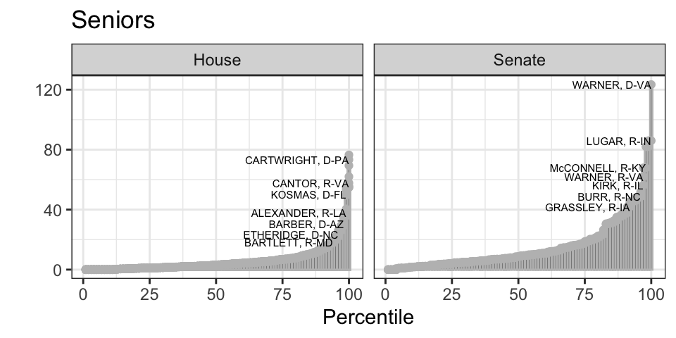
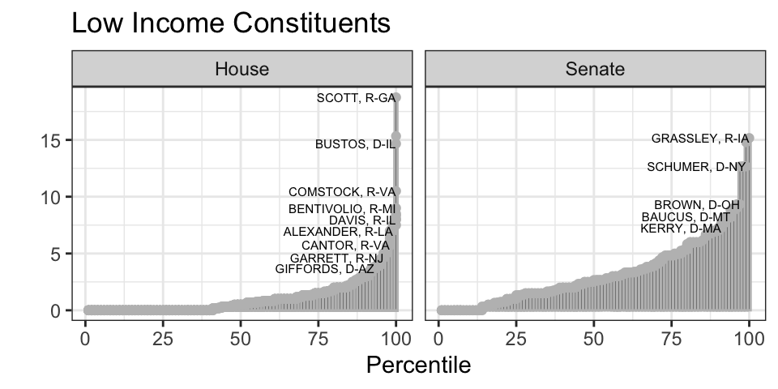
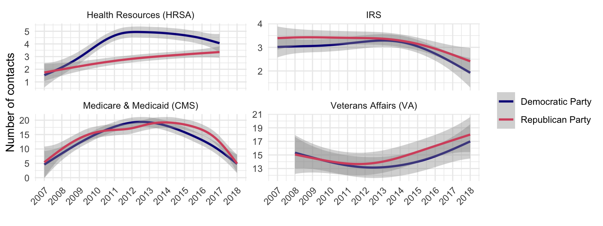
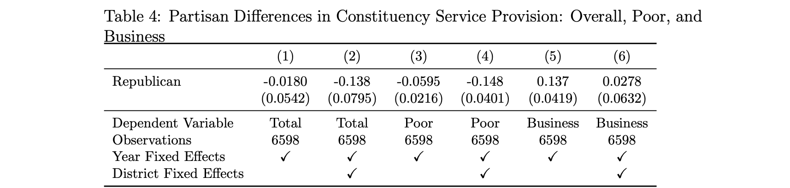
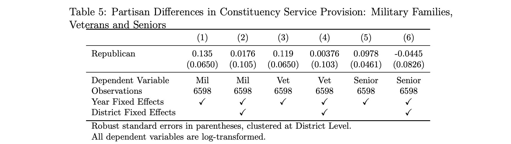

```{r setup, include = FALSE, cache = TRUE, echo = FALSE}
# chunks options:
# hide code and messages by default (warning, message)
# cache everything 
knitr::opts_chunk$set(eval = TRUE, 
                      echo = FALSE,
                      warning = FALSE, 
                      message = FALSE,
                      cache = FALSE,
                      fig.retina = 2,
                      fig.align = "center", 
                      dpi = 100)
# Xaringan: https://slides.yihui.name/xaringan/
library("xaringan")
library("xaringanthemer")
library("here")


mono_light(base_color = "#3b444b",
          link_color = "#B7E4CF",
          #background_color = "#FAF0E6", # linen
          header_font_google = google_font("PT Sans"), 
          text_font_google = google_font("Old Standard"), 
          text_font_size = "28px",
          padding = "10px",
          code_font_google = google_font("Inconsolata"), 
          code_inline_background_color    = "#F5F5F5", 
          table_row_even_background_color = "#E6F0FA",
          extra_css = 
            list(".remark-slide-number" = list("display" = "none")))

```

```{r, eval = FALSE, include= FALSE}
# setup
devtools::install_github("yihui/xaringan")
devtools::install_github("gadenbuie/xaringanthemer")
install.packages("webshot")
# webshot::install_phantomjs()

library(webshot)

# export to pdf
file <- here("present/whyMail-APW.html")
webshot(file, "whyMail-APW.pdf")
```


# Outline

1. What is constituent service?

1. Theory: Reasons that some groups may be served more than others

1. Data: 400,000+ requests from all Members of Congress to all federal agencies

1. Which groups are better served? (difference in differences)  
- Republicans do less constituent service, 15% less for low-income constituents (within a district) 
- Veterans and seniors are served proportionate to their population; low-income residents are not


???
Hi, my name is Devin Judge-Lord. I'm a Ph.D. candidate at Wisconsin. 

My colleague at Wisconsin, Rochelle Snyder really led the writing and coding the data for this paper, but she, unfortunately, is teaching at this moment. 

This paper is a new piece of a much larger project we have been working on for over four years, but this specific exploration of how different types of individual constituents are served more than others is Rochelle's brainchild.


---

# What is Constituent Service?

"help to individuals, groups, and localities in coping with the federal
government." (Fenno, 1978: p. 101)

-   Individual casework

-   Organized groups

-   Unorganized groups

-   Companies

???

Here we focus on individual casework and a bit on companies. We talk more about companies and organized groups in other papers. 

---

Builds upon important prior work that focused on specific legislator-agency pairs (Ritchie 2017; Mills and Kalaf-Hughes 2015; Lowande 2018)

---

### Correspondence Data

Federal Energy Regulatory Commission


---

### Correspondence Data

Department of Veterans Affairs


---

### Correspondence Data

VA Detroit Regional Offices


---

### Correspondence Data

VA National Cemetary Administration


---

### Correspondence Data

Department of Homeland Security Immigration and Customs Enforcement
(ICE) 

---

### Correspondence Data

IRS


---

### Correspondence Data

Centers for Medicare & Medicaid Services

---

400+ FOIA requests to 294 federal agencies (a census)

400,000+ legislator requests (so far), 2007-2020

```{r, echo=FALSE, warning=FALSE, message=FALSE}
library(kableExtra)
library(tidyverse)
read_csv(here::here("data/_FOIA_response_table.csv") ) %>% 
  select(-X1) %>% 
  kable() %>% 
  kable_styling(font_size = 12) %>% 
  row_spec(17, bold = T, background = "#B7E4CF")
```

---


### Types of contacts


---


---

## Unequal Levels of Advocacy Overall

Count of letters per member per year



---


## Unequal Levels of Advocacy *Within* Constituent Types



---

## Unequal Levels of Advocacy *Within* Constituent Types




---

## Unequal Levels of Advocacy *Within* Constituent Types



---

# What explains variation in levels of constituency service across legislators?

## [?] District demographics 
## [?] Partisan-aligned differences in valorized and stigmatized populations


---

# District demographics

Overall, **little systematic bias** in which districts receive more service. The average letter comes from an average district (average income, percent below the poverty line, percent over 65, etc.).

### Sub-constituency size 

[ $\checkmark$ ] Strong relationships between the percent of **seniors** or **veterans** and the number of letters on behalf of these groups.

[  ]  No relationship between the percent below the poverty line or **median income** and letters on behalf of poor or working-class constituents (e.g., regarding means-tested programs)

---

## Partisan differences (in differences)



---

Republicans provide less service overall, much less to poor constituents,



but no difference in service to businesses, seniors, or military families.



---

### Questions going forward:

Can we attribute unequal representation to  
1. structural features of federalism in the U.S.?
1. members perceiving groups as "deserving"?
1. second-order constituent beliefs about whether officials will help them?

Other informative groups?
- immigrants
- non-White constituents
- disability 

Why do Republicans do less constituent service? 

# Thank you!

???

For our questions going forward, I again want to lament the fact that Rochelle is not here because her dissertation is exactly about why constituents contact legislators and will help us get at the first question about whether we can parse the reasons for unequal representation that we find. Is it because elected officials discriminate or that constituents don't even bother reaching out to legislators who they don't believe will help them? 

Are low-income constituents paying close enough attention to who is in office that they stop seeing help when a republic takes over, or do Republican legislators put less priority on this type of representation? 


---

### Constituency Demand


