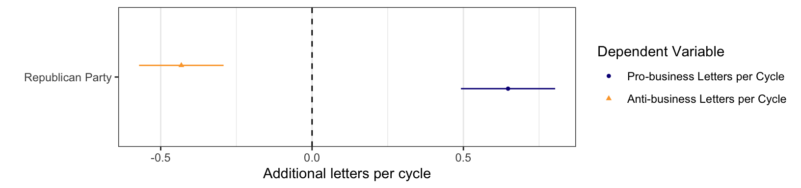

```{r setup, include = FALSE, warning=FALSE, message=FALSE}
knitr::opts_chunk$set(eval = TRUE, 
                      warning = FALSE, 
                      message = FALSE,
                      cache = TRUE,
                      echo = FALSE,
                      fig.path = "figs",
                      out.width = "800\\linewidth",
                      #out.height = "600px",
                    fig.retina = 2, 
                      dpi = 100,
                      fig.align = "center")
# Xaringan: https://slides.yihui.name/xaringan/
#library("xaringan")
library("xaringanthemer")
library("here")

xaringanthemer::mono_light(#base_color = "#003333",
          link_color = "#b7e4cF",
          #background_color = "#FAF0E6", # linen
          header_font_google = google_font("PT Sans"), 
          #text_font_google = google_font("Old Standard"), 
          text_font_size = "30px",
          padding = "10px",
          code_font_google = google_font("Inconsolata"), 
          code_inline_background_color    = "#F5F5F5", 
          extra_css = list(".remark-slide-number" = list("display" = "none")),
          table_row_even_background_color = "#E6F0FA")

```


```{r, eval = FALSE, include= FALSE}
# # setup
# devtools::install_github("yihui/xaringan")
# 1
# devtools::install_github("gadenbuie/xaringanthemer")
# install.packages("webshot")
# webshot::install_phantomjs()
# library(webshot)

install.packages("pagedown")
#install.packages("websocket")
library(pagedown)

# export to pdf
file <- here::here("FERC/2020AESS.html")
# webshot(file, "FERC/2020AESS.pdf")
pagedown::chrome_print(file)
```

# The political power of fossil fuel companies

Do corporate campaign contributions affect policymakers? 

Surprisingly, political scientists have generally failed to find that campaign contributions affect behavior (usually roll-call votes).

But donor companies may target members of key committees (Powell and Grimmer 2015), reward favorable voting records (Goldberg et al. 2020), or be less likely to comply with regulations (Gordon and Hafer 2005).

---

# Preview

We collect letters from Members of Congress to the Federal Energy Regulatory Commission and link them to corporate campaign contributions.

We find that **Republicans** and those who receive more **money from the energy-sector** write more letters on behalf of energy companies, but no more letters on behalf of their constituents than other legislators.

---

class: inverse

# Legislator letters

- "Public records" but difficult to obtain

- Less constrained by party leaders than votes

- Targeted at one government decision (unlike bills that often do multiple things)

- Likely aligned with other types of "behind-the-scenes" advocacy

Low visibility --> opportunity for corporate influence

---

Having more constituents does not necessarily mean more letters.


??? 

If legislators are not responding to constituent demand, to what are they responding?


---

## Why study the Federal Energy Regulatory Commission?


- FERC regulates electricity markets, oil and gas pipelines, hydropower projects, and liquified natural gas export projects

-   FERC makes policy and enforcement decisions that have major consequences for how energy is produced, the distribution of energy-sector jobs, profits, and the cost of the of electricity and fuels

---

## Why study the Federal Energy Regulatory Commission?

A hard case to find congressional influence:

-   Designed to be insulated from political influence

  -   Independent non-partisan commission.

  -   The five commissioners are appointed to staggered 5-year terms,
        and no more than three can be from one party

Yet, FERC receives hundreds of letters from Members of Congress
    each year.
    

---

class: inverse

# Do campaign contributions affect congressional-bureaucratic relations?

-   Letters to FERC are less visible than roll-call votes.

-   FERC decisions have high stakes for companies.

- [The Center for Responsive Politics'](https://www.opensecrets.org/) industry classification of corporate Political Action Committees allows us to link Political Action Committees (PAC) to energy companies that are regulated by FERC. 

---

## Political Action Committee (PAC) Spending

Unequal spending across companies


---

## PAC Campaign Contributions by Party


A large and growing Republican bias in the energy sector


---

## PAC Campaign Contributions by Legislator

A strong and growing Republican bias in the energy sector


---

class: inverse

# The Larger Project

Congress-Bureaucracy Correspondence Data

-   400+ FOIA requests to all 233 federal agencies (a census)

-   Requesting all contacts (letters/emails/phone calls) between Members of Congress and federal agencies 2007-2018. In some cases, records go back further.

-   Since 2016, we have received data on 480,000+ legislator letters
  -   Digital Spreadsheets
  -   PDFs
  -   Scans of Handwritten Documents
  -   CD-ROMS
  -   Photocopies

???

While this paper focuses on FERC, we compare legislator advocacy at FERC to legislator advocacy overall, so I want to give you a picture of where those data come from. 


---

6,119 letters to FERC. Some are co-signed, so n = 6,988.

```{r}
library(magrittr)
library(tidyverse)
library(kableExtra)

read_csv(here::here("data/_FOIA_response_table.csv")) %>% 
  select(-X1) %>% 
  #as_tibble() %>% 
  knitr::kable(format = "html") %>% 
  kable_styling(font_size = 16) %>% 
  row_spec(5, background = "yellow") %>% 
  row_spec(17, bold = T) 
```

---

class: center inverse

# Examples of letters to FERC

---

On behalf of energy companies, supporting a permit or project

```{r, , out.width = "550px"}
knitr::include_graphics(here::here("FERC/figs/FERC_mooney.png"))
```

---

On behalf of energy companies, supporting a permit or project

```{r, out.width = "550px"}
knitr::include_graphics(here::here("FERC/figs/FERC_thornberry.png"))
```

---

On behalf of individuals and non-energy companies, opposing an energy project

```{r, out.width = "550px"}
knitr::include_graphics(here::here("FERC/figs/FERC_collins.png"))
```

???

This is a constituency service letter written by Senator Susan Collins
(R-ME) to FERC on April 28, 2008.

---

On behalf of his own business, opposing an energy project

```{r, out.width = "550px"}
knitr::include_graphics(here::here("FERC/figs/FERC_graham.png"))
```


---


Not always "behind-the-scenes."

```{r, out.width = "550px"}
knitr::include_graphics(here::here("FERC/figs/schumer-cosigned-letter-tweet.png"))
```

---

### FERC Data

-   Full text of all letters from Congress to FERC

-   6,988 members-level observations

-   From January 1, 2000, to December 31, 2018

-   Every letter: human coder + automated processing to identify
  - The authoring legislator(s)
  - Any companies or projects it supported or opposed
  - Whether any projects were in the district they represent
  - Whether it was constituent service (on behalf of an individual constituent, nonprofit, local government, or company) or about policy (legislation or rulemaking)

-   Connected to campaign donations from the energy sector

---

### Types of Congressional Requests FERC vs. All\* Agencies


Letters to FERC are disproportionately on behalf of businesses.

---

We count the number of each type of letter that each legislator sent to FERC in each congress.


---

We count the number of each type of letter that each legislator sent to FERC in each congress.


---

We examine the effects of legislators' institutional power [elsewhere](https://judgelord.github.io/research/correspondence/)


---

class: inverse center

# Findings

---

## Letters on behalf of individual constituents usually oppose energy projects


---

## The relationship between campaign donations and different types of advocacy


- PAC money is correlated with pro-business advocacy, but not constituent advocacy, suggesting that we are pro-business letters are not just about district interests

- Correlations are small, but likely indicate other types of advocacy

???

Poisson model of the relationship between PAC money received in an election cycle and each type of letter sent in the following congress. *no time-series lag, so we can't say PAC money is an investment or reward.

---
## The relationship between party and different types of advocacy




- Republicans write fewer anti-business and more pro-business letters than Democrats

???

Poisson model of the relationship between party and each type of letter sent in the following congress.

---

## Party and Campaign Donations


- For pro-business advocacy, the difference between two legislators of the same party, where one receives $100,000 more than the other, is comparable to the difference between a Republican and a Democrat

- For anti-business advocacy, there is no evidence that money matters once we account for differences by party

???

- It's not just one's party or funding; both matter

Poisson model of the relationship between both party and money with each type of letter.


---

# Conclusions

-   A new look at the role of money in politics, congressional representation, the politics of agency decisionmaking

-   FERC has an unusually high rate of advocacy on behalf of businesses

-    **Republicans** and those who receive **money from the energy companies** write relatively more letters on behalf of energy
    companies, but not on behalf of constituents

-   Democrats write comparatively more letters in opposition to energy
    companies

---

# Next steps

- Match individual companies mentioned in letters to campaign contributions

- Identify all companies that had business with FERC (including where no legislator intervened)

- Compare constituent demographics between a legislator's districts and letters

- Text analysis to uncover trends in corporate and congressional advocacy

- Impact of Letters on Outcomes (the outcome or speed of FERC decisions)

---

# Challenges

- Linking energy projects, subsidiary companies, and parent companies

- Understanding energy company behavior (how do company officials decide to engage elected officials?)

- Parsing elected officials' multiple motivations (ideology, fundraising, jobs in their district, environmental harms)

---

class: inverse

# Discussion 

- Trends in energy company lobbying we should be looking for? 

- How might we measure public support for specific energy projects? 

- What else might we study with these data? 

- Research with which we should engage? 

# *Thank you!*

Paper and slides at [judgelord.github.io/research/ferc/](https://judgelord.github.io/research/ferc/)

Comments & questions welcome: [judgelord@wisc.edu](mailto:judgelord@wisc.edu) [@judgelord](https://twitter.com/JudgeLord)

