```{r setup, echo = FALSE, warning=FALSE, message=FALSE}
# chunks options:
# hide code and messages by default (warning, message)
# cache everything 
knitr::opts_chunk$set(eval = TRUE, 
                      warning = FALSE, 
                      message = FALSE,
                      cache = TRUE,
                      echo = FALSE,
                      fig.path = "figs",
                      out.width = "800\\linewidth",
                      #out.height = "600px",
                    fig.retina = 2, 
                      dpi = 100,
                      fig.align = "center")
# Xaringan: https://slides.yihui.name/xaringan/
library("xaringan")
library("xaringanthemer")
library("here")


mono_light(#base_color = "#003333",
          link_color = "#0000EE",
          #background_color = "#FAF0E6", # linen
          header_font_google = google_font("PT Sans"), 
          text_font_google = google_font("Old Standard"), 
          text_font_size = "30px",
          padding = "10px",
          code_font_google = google_font("Inconsolata"), 
          code_inline_background_color    = "#F5F5F5", 
          table_row_even_background_color = "#E6F0FA",
          extra_css = list(".remark-slide-number" = list("display" = "none")))

```


```{r, eval = FALSE, include= FALSE}
# setup
devtools::install_github("yihui/xaringan")
devtools::install_github("gadenbuie/xaringanthemer")
install.packages("webshot")
# webshot::install_phantomjs()

library(webshot)

# export to pdf
file <- here("FERC/AESS2020.html")
webshot(file, "FERC/AESS2020.pdf")
```

View these slides here: <https://judgelord.github.io/correspondence/FERC/2020AESS.html>

Download the draft paper [here](https://github.com/judgelord/correspondence/raw/master/FERC/FERCpaper2019.pdf).

---

# The political power of energy companies

Do corporate campaign contributions affect policymakers? 

Surprisingly, political scientists have generally fail to find that money affects behavior

- usualy vote: not where we expect to observe influcne

But donor companies may target members of key committees (Powell and Grimmer 2015) or reward favorable voting records (Goldberg et al. 2020), or comply less with regulations.

---

# Preview

We collect data on congressional advococay and oversight: letters from Members of Congress to the Federal Energy Regulatory Commission

We find that **republicans** and those who recieve more **money** from the energy-sector write more letters on behalf of energy companies, but no more letters on behalf of their constituents than other legislators.

---

# Legislator letters

- "Public records" but difficult to obtain

- Less constrained by party leaders than votes

- Targeted at one government decision (unlike bills that often do multiple things)

- Likely aligned with other types of "behind-the-scenes" advocacy

Low visibility --> opportunity for corporate influnce


---

# Why Study the Federal Energy Regulatory Commission?

What FERC Does:

-   Regulates electricity markets, oil and gas pipelines, hydropower
        projects, and liquified natural gas export projects.

-   Makes policy and enforcement decisions that have major
        consequences for how energy is produced, the distrbution of energy-sector jobs, profits, and the cost of the of electricty and fuels.

---

# Why Study the Federal Energy Regulatory Commission?

A hard case to find congressional influence:

  -   Designed to be insulated from political influence

    -   Independent non-partisan commission.

    -   The five commissioners are appointed to staggered 5-year terms,
        and no more than three can be from a one party

Yet, FERC receives hundreds of letters from Members of Congress
    each year.
    
---

# Letters from Legislators to FERC

More constituents does not necessarily mean more letters.

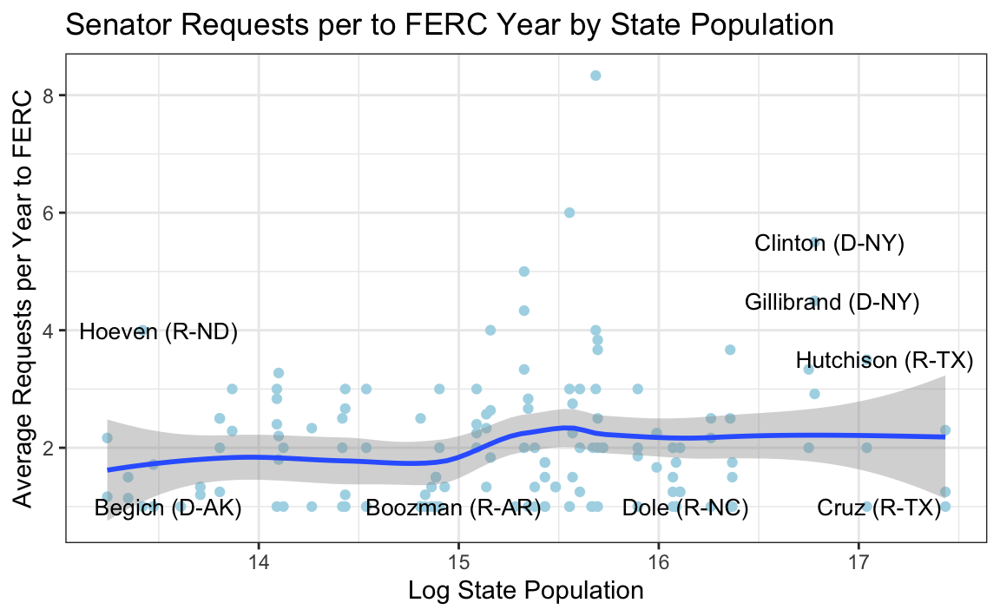

---

# Political Action Committee (PAC) Campaign Contrabutions


---

# PAC Campaign Contrabutions by Party


A strong and growing Republican bias in the energy sector

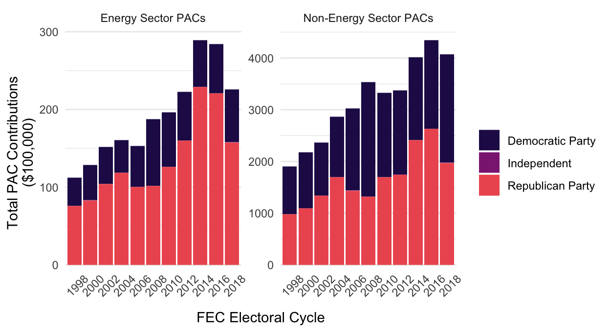

---

# PAC Campaign Contrabutions per Legislator

A strong and growing Republican bias in the energy sector

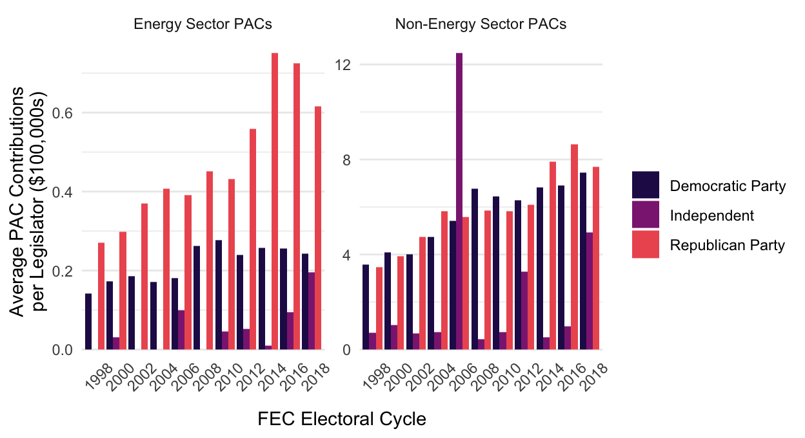

---

# The Influence of Campaign Contributions on Congressional-Bureaucratic Relations

-   Avenue for Influence: Letters to FERC are less visible than roll call
    votes

-   High stakes for companies

-   Corporate PAC contributions from Energy Sector

---

# The larger Project: Congress-Bureaucracy Correspondence Data

-   400+ FOIA requests to all 233 federal agencies (a census)

-   Requesting all contacts (letters/emails/phone calls) between Members of Congress and federal agencies 2007-2018

-   In some cases, like FERC, records go back further

-   We began placing these requests 4 years ago

-   Data include 480,000+ legislator letters (and counting)


???

While this paper focuses on FERC, we compare legislator advocacy at FERC to legislator advocacy overall, so I want to give you a picture of where those data come from. 

---

### FERC Data

-   Full text of all letters from Congress $\rightarrow$ FERC

-   From January 1, 2000, and December 31, 2018

-   Every letter: human coder + automated processing

-   6,988 members-level observations for 2000-2018

-   Connected to campaign donations from the energy sector.

---


### Format of Data We Received

-   Digital Spreadsheets

-   PDFs

-   Scans of Handwritten Documents

-   CD-ROMS

-   Photocopies

???

---

class: center

# Examples of letters to FERC

---

On behalf of energy companies, supporting a permit or project

```{r, out.height = "600px"}
knitr::include_graphics(here::here("FERC/figs/FERC_mooney.pdf"))
```

---

On behalf of energy companies, supporting a permit or project

```{r}
knitr::include_graphics(here::here("FERC/figs/FERC_thornberry.png"))
```

---

On behalf of non-energy companies, opposing an energy project

```{r, out.height = "600px"}
knitr::include_graphics(here::here("FERC/figs/FERC_collins.pdf"))
```

???

This is a constituency service letter written by Senator Susan Collins
(R-ME) to FERC on April 28, 2008.

---

On behalf of his own ranch, opposing an energy project

```{r, out.height = "600px"}
knitr::include_graphics(here::here("FERC/figs/FERC_graham.pdf"))
```


---


Not always "behind-the-scence"

```{r}
knitr::include_graphics(here::here("FERC/figs/schumer-cosigned-letter-tweet.png"))
```


---

### Types of Congressional Requests FERC vs. All\* Agencies

```{r}
knitr::include_graphics(here::here("FERC/figs/data-by-type-1.png"))
```

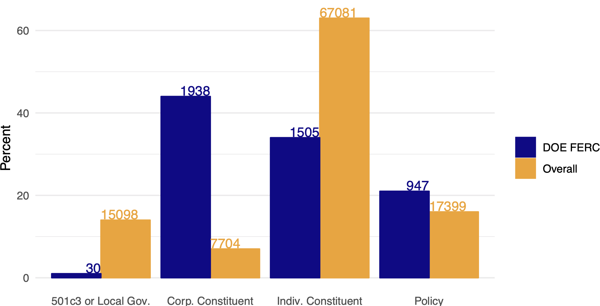

For each letter we identified the authoring legislator(s), any companies or projects it supported or opposed, whether it was about constituent service or policy. 

---

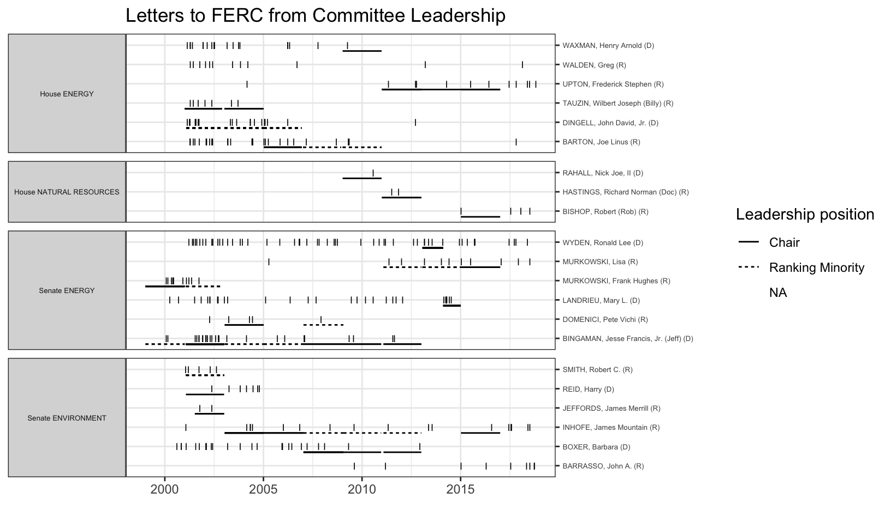

---


# Findings

Letters on behalf of individual constituents usually opposed energy projects


---

## Money 

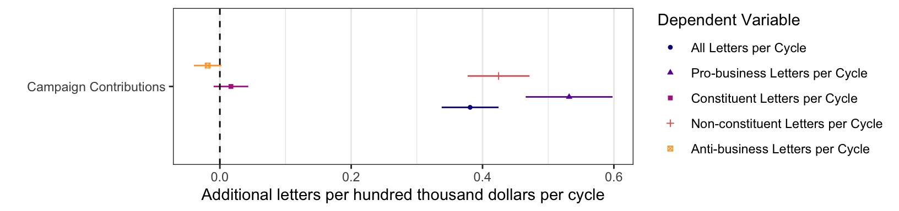

Poisson model of the relationship between PAC money and each type of letter. *no time-series lag, so we can't say PAC money is an investment or reward.

  - PAC money is correlated with pro-business advocacy, but not constituent advocacy, suggesting that we are pro-business letters are not just about district interests
- Correlations are small, but likely indicate other typoes of advocacy

---

## Party


  - Republicans write fewer anti-business and more pro-business letters than Democrats

---

## Party and Money


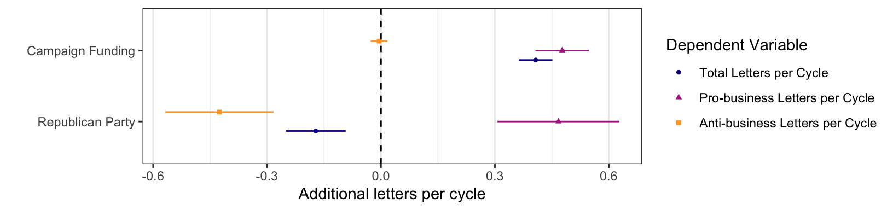

Poisson model of the relationship between both party and money with each type of letter.


- For pro-business advocacy, the difference between two legislators of the same party, where one recieves $100,000 and the other recieves 
$0, is comprable to the difference between a Republican and a Democrat
- For anti-business advocacy, there is no evidece that money matters once we account for differences by party

???

- It's not just one's party or funding; both matter


---

# Next steps

- Match individual companies mentioned in letters to campaign contributions

- Idententify all companies that had busness with FERC (including where no legislator intervened)

- Compare constituent demographics between a legislator's districts and letters

- Text analysis to uncover trends in corporate and congressional advocacy

---

# Discussion 

- Trends in energy company lobbying that we might look for? 

- How might we measure public support for specific energy projects? 

-

- What else might we study with these data? 

- Research whith which we should engadge? 

*Thank you!*

---

-   Who Writes on Behalf of Constituents vs. Business?

---

### What Types of Letters are Supportive of Businesses?

---

### What Types of Letters are Supportive of Businesses?

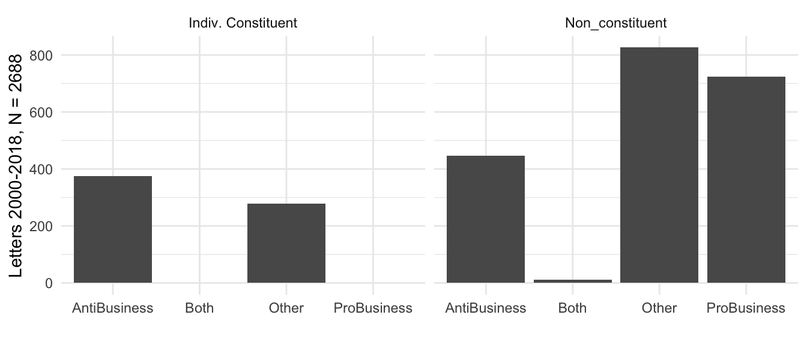

What Members Attempt to Influence FERC?

---

### Senators Writing the Most Letters to FERC

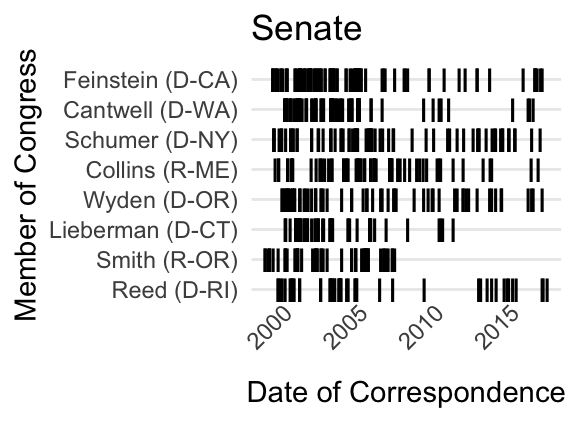

---

### Representatives Writing the Most Letters to FERC

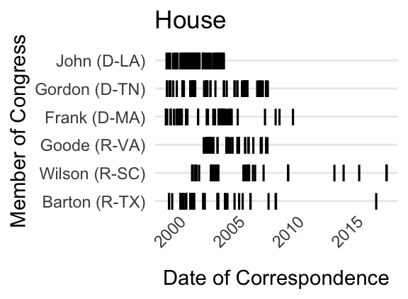

---

# Who Writes on Behalf of Constituents vs. Business?

By Party and Majority Status

---

# Who Writes on Behalf of Constituents vs. Business?

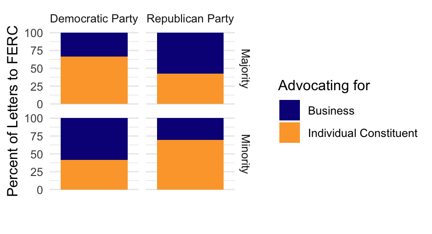 **Figure
[\[f:party\]](#f:party){reference-type="ref" reference="f:party"}:** .

---

#  Is Legislator Advocacy Driven by Constituent Demand?

### State population and Senate Letter-writing

 

---

### FERC Contacts from Senators by State

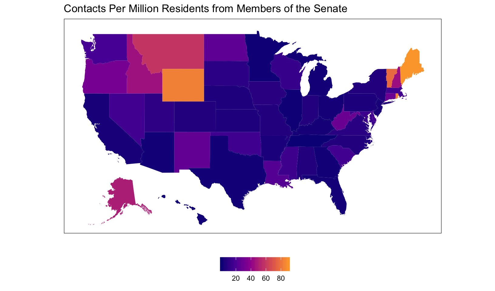 

---

### 

Committee Chairs Attempting to Influence FERC?

### Committee Chairs Attempting to Influence FERC


---

### 

Exploring the Relationship between Letter-writing and Campaign
Contributions

---

### Measuring Industry Money

-   Campaign contribution data from Adam Bonica's Database on Ideology,
    Money in Politics, and Elections bigskip

-   Center for Responsive Politics' industry classification of PACs.

---

### Average Energy Sector PAC Contributions Per Member Per Cycle

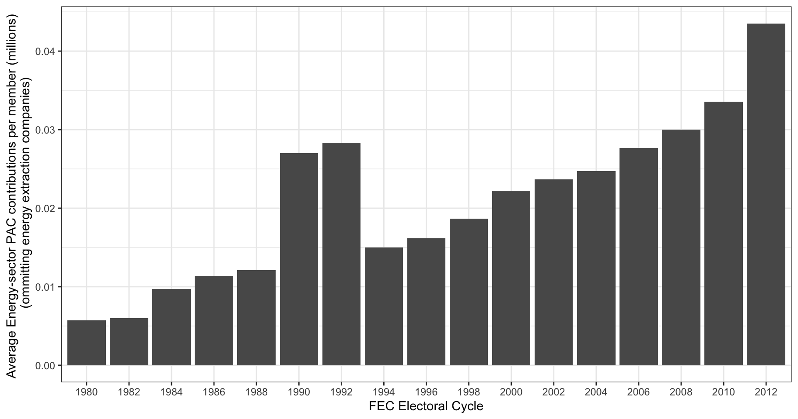

---

### Partisan Differences in Energy \$

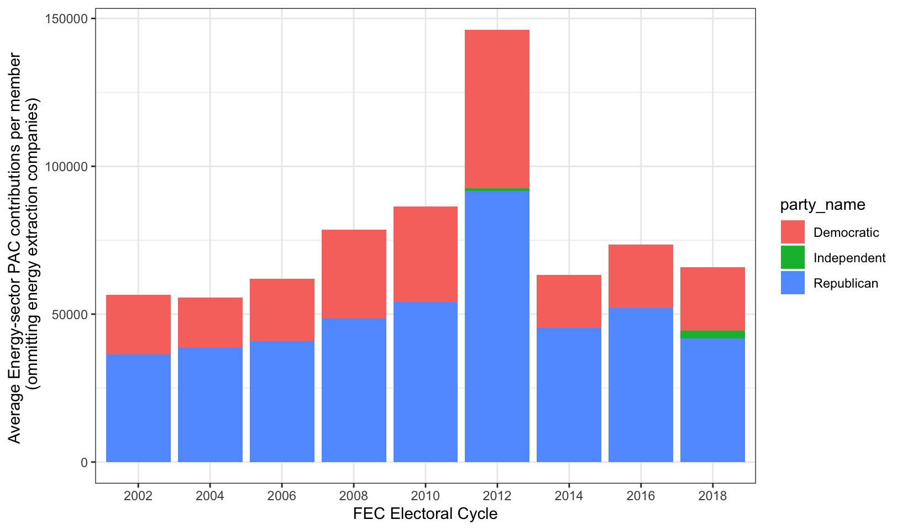

Preliminary Results: Relationship between Letter-writing and Campaign
Contributions?

---

### Campaign Contributions and Letter-writing to FERC

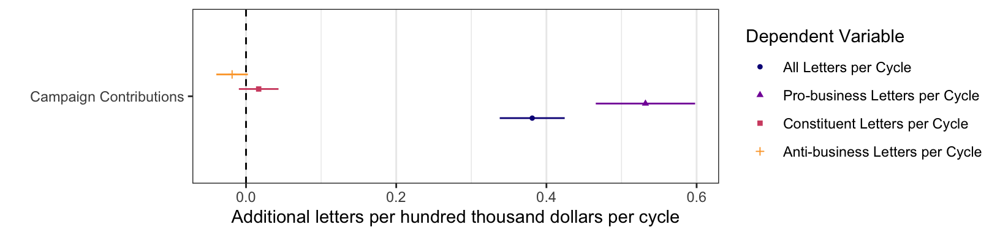

---

### Campaign Contributions, Party and Letter-writing to FERC


---

### Next Steps

-   Connecting Companies in Letters to Campaign Contributions

    -   Challenge: Linking Energy Projects, Subsidiary Companies and
        Parent Companies

-   Impact of Letters on Outcomes

    -   Speed of FERC Review


in district 


should the movement use money in the same way? 
do boycotts work? 
what do we do with these findings? 

MY QUESTIONS 
- energy company behavior 
- is this good for me electorally - jobs - pollution
- 

COMMENTS 
- walk through figures 


---

### Conclusions

-   A new look at the role of money in politics, congressional representation, the the politics of agency decisionmaking

-   FERC has an unusually-high rate of advocacy on behalf of businesses

-    **Republicans** and those who receive **money from the energy companies** write relatively more letters on behalf of energy
    companies, but not on behalf of constituents

-   Democrats write comparatively more letters in opposition to energy
    companies

Thank you!

---

### Correspondence Data

Environmental Protection Agency 

### Correspondence Data

Department of Homeland Security Immigration and Customs Enforcement
(ICE) 

### Correspondence Data


### Agency Character: CIA $\#$OnBrand


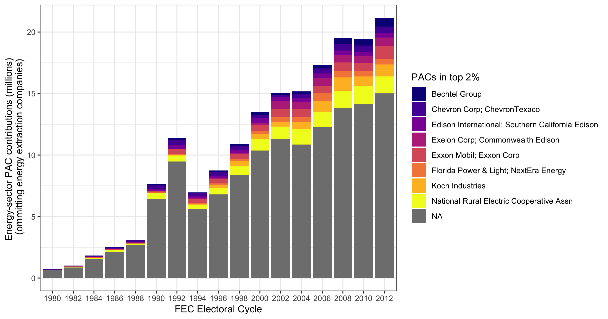 **Unequal Money
Across Energy Sector PACs**

---

### Our Correspondence Data

[\[\]]{label=""}

  ----------------------------------------- ------------ ---------- ------- --------
                                               FOIAed     Records    Coded     N
                                             Components   Received          
                                                                            
  Department of Agriculture                      29          29       11      1957
  Department of Commerce                         18          18       10      6875
  Department of Defense                          49          10        7      5479
  Department of Education                        1           1         1      3868
  Department of Energy                           8           2         1      1269
  Department of Health and Human Services        15          7         5      6199
  Department of Homeland Security                6           5         5     26435
  Department of Housing & Urban Dev.             2           0         0       0
  Department of Justice                          11          1         1      903
  Department of Labor                            24          9         6     22936
  Department of State                            1           0         0       0
  Department of the Interior                     10          6         5      5171
  Department of the Treasury                     8           5         4     11143
  Department of Transportation                   10          6         6     18482
  Department of Veterans Affairs                 3           0         0       0
                                                                            
  Independent Agencies                           38          21       18     46182
                                                                            
  Total                                         233         120       80     156899
                                                                            
  ----------------------------------------- ------------ ---------- ------- --------


---


Bureaucrats and legislators who *anticipate* how
        others will react to their actions.

-   Legislators anticipate how constituents will react to their
        behavior

-   Bureaucrats anticipate how the decisions they make will affect
        members of Congress.

---

### How do legislators signal to bureaucrats?

-   New insight via: legislator's letters to bureaucracy
