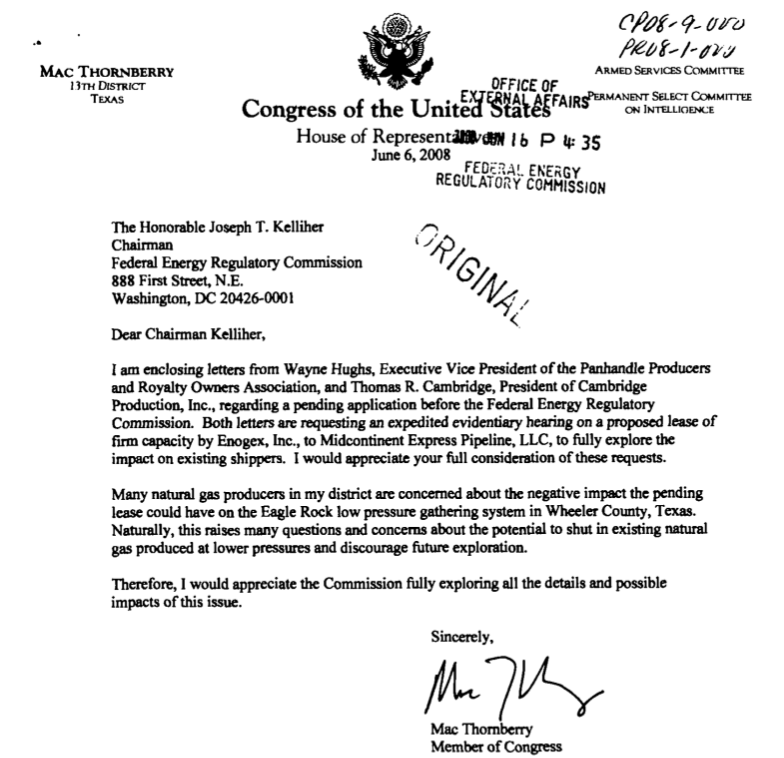
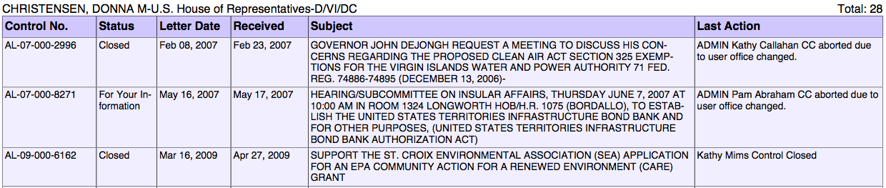
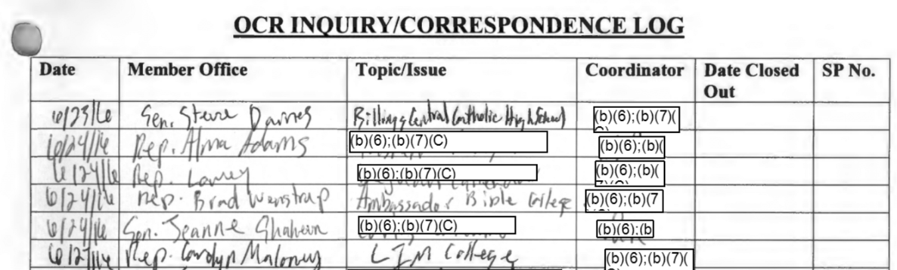

<!-- [Project Summary](https://judgelord.github.io/correspondence/project_summary.html)
[Attention Allocation Paper Summary](https://judgelord.github.io/correspondence/APSA2018/summary.html) (for 2018 APSA paper) 
[FERC Paper Summary](https://judgelord.github.io/correspondence/FERC/summary.html) (Energy Sector Campaign Funding and Letters)-->

This repository contains code to merge, augment, and analyze data on congressional correspondence with the federal bureaucracy.

# Data
- Correspondence data come from FOIA requests, FOIA reading rooms, and web scraping disclosed correspondence. Some data include the full text of letters, but most are in the form of correspondence logs maintained by agencies, which may include phone, email, letterhead contacts (#92). Some letters are signed by more than one member, so each member-level observation is given a unique `ID` and as well as a `LetterID` that is unique to each letter or phone call.
- Member data from <https://www.voteview.com/> are augmented in `members/nameCongress.R`  [#9](https://github.com/judgelord/correspondence/issues/9) and committee membership data are augmented from Charles Stewart III and Jonathan Woon, Congressional Committee Assignments, 103rd to 114th Congresses, 1993--2017, <http://web.mit.edu/17.251/www/data_page.html> in `committees/committees.R` [#12](https://github.com/judgelord/correspondence/issues/12)

## TODO 
- [ ] Add agency data [#83](https://github.com/judgelord/correspondence/issues/83)
- [ ] Improve codebook to better code constituent class [#82](https://github.com/judgelord/correspondence/issues/82) and policy events [#4](https://github.com/judgelord/correspondence/issues/4)
- [ ] FOIA letters with insufficient log data [#76](https://github.com/judgelord/correspondence/issues/76)
- [ ] Add member comments from regualations.gov

Tasks recently completed: 
- [x] ~~Clean scrips for DHS_NIH, DOI_BIA, DOL_OASAM**, DOT_FRA**, EEOC**,Treasury_Mint~~
- [x] Check members that switched chambers or left/joined mid congress. These are corrected in the `MemberNameDateCorrections.R` script in the members folder [#10](https://github.com/judgelord/correspondence/issues/10)

# Want to help? 

Here are some tasks that anyone can do: 
- Find letters that Members of Congress write to agencies (e.g. letters they post on their website) and email them to CorrespondenceResearch@gmail.com. We will check to see if they are in our data and add them. 
- Look at [this list](https://github.com/judgelord/correspondence/blob/master/data/worst.names.csv) of letter authors that we are failing to match to a legislator. Note typos or odd formatting in issue [#9](https://github.com/judgelord/correspondence/issues/9). Note cases where names appear to be spelled correctly and formatted in a conventional way in issue [#62](https://github.com/judgelord/correspondence/issues/62). Note cases where the author is not a Member of Congress in the "debug" issue for that agency (e.g. "debug EPA").

# For collaborators

- Data are stored in google sheets in the project's [google drive](https://drive.google.com/drive/u/0/folders/1bZ-h4nbkvZng6Ea4Aexw7n-Kh-JXmsTz) in the "datasheets" folder
- Some still need to be extracted from pdfs #77
- Data extracted from pdfs but not yet uploaded to google drive should have an open issue named "add AGENCY data to drive"
- Memes should be posted to #158

All datasheets must have these columns:
- `FROM` is the column with the name(s) of the Member(s) of Congress that signed the letter. If names are in multiple columns, a new FROM column will be created in the script cleaning those data. 
- `DATE` is the date of the letter (or the best approximation).
- `SUBJECT` is a summary of the letter's content. If more than one column contains substantive information, these are added to SUBJECT in the script cleaning those data. 

Most datasheets have additional columns, such as the letter's text, priority level, date of reply, or the person in the agency tasked with responding to the letter. Because such information is not consistent across agencies, these are dropped when sheets are merged. They can be added back in for a more detailed analysis of specific departments or agencies. For example, see the [more detailed analysis of FERC](https://judgelord.github.io/correspondence/FERC/FERCsummary.html#models). 

Other columns required for applying the [codebook](https://docs.google.com/document/d/1fJxjXjAyRL9vX-16fSsH29anXZc-W74GMf_7BSgWkws/edit) are added by the function in `prep sheets.R`.

## Cleaning

- Sheets that need cleaning should have an open issue named "clean script for AGENCY" (e.g., "clean script EPA") 
- When the clean script is done, remember to it to `merge.R`
- If additional work is needed, there may be an issue called "debug AGENCY" (e.g., "debug EPA") 

If `extractMemberName()` fails to match:

1. Inspect the `pattern` variable
1. Missing permutations of names in the `members` data can be added in `nameCongress.R` or noted in #9
1. Common typos can be corrected in `MemberNameTypos.R`
1. If the pattern exists, but `extractMemberName()` fails to find it, note this in #62 

Where there is insufficient information to identify a letter's date or author, the `NOTES` column should include "FOIA" and commits tagging observations to FOIA should reference [#76](https://github.com/judgelord/correspondence/issues/76)

## Coding

[Codebook](https://docs.google.com/document/d/1fJxjXjAyRL9vX-16fSsH29anXZc-W74GMf_7BSgWkws) 

Data that are ready for coding should have an open issue named "apply codebook to AGENCY"
- Interesting letters/anecdotes should be tagged with #172

Where there is insufficient information to code a letter, the `NOTES` column should include "FOIA" and [#76](https://github.com/judgelord/correspondence/issues/76) should be tagged in the "apply codebook" issue.

## Validating

- Validation issues should begin with "validate"

# Example letter

# Example logs

